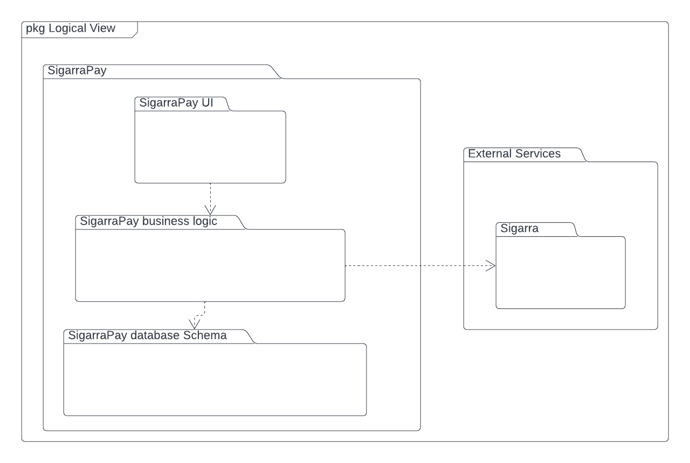
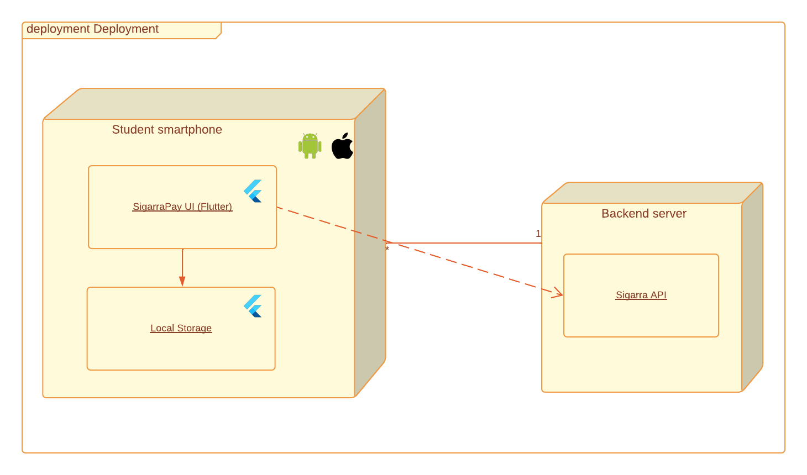
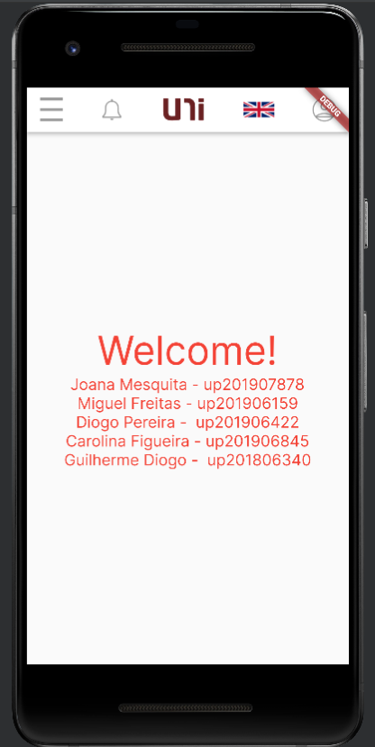

# Architecture and Design

## Logical architecture

### SigarraPay UI
Refere-se à interface do utilizador da aplicação o que incluiu todas as paginas desta.

### SigarraPay business logic
Refere-se à parte da aplicação que faz pedidos ao Sigarra e que organiza informação recebida.

### SigarraPay database
Refere-se à parte da aplicação que armazena as configurações de notificações do utilizador assim como o seu histórico.

## Physical architecture

## Vertical prototype

Neste prototipo implementamos a opção de mudar a aplicação de linguagem de uma forma rudimentar (já que só temos uma linha de texto de momento na aplicação) como é possível ver nas imagens seguintes. Esta mudança é feita atravéz de pressionar o icon da bandeira de Portugal ou da Inglaterra no canto superior direito.

| Versão Portuguesa | Versão Inglesa |
|--|--|
| | |
