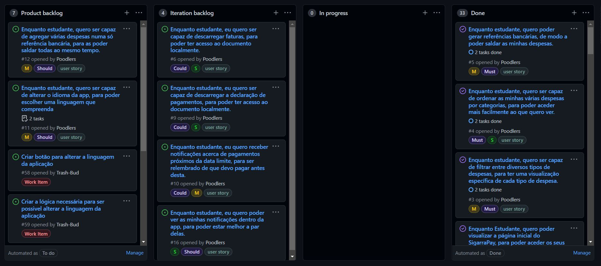
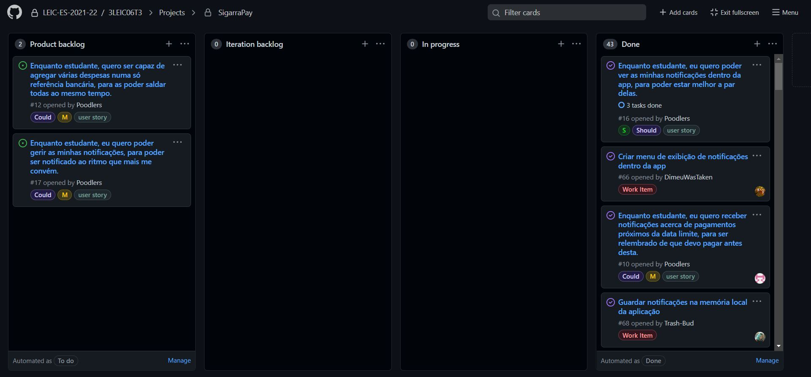

# Iteration retrospective meeting
#16 - Enquanto estudante, eu quero poder ver as minhas notificações dentro da app, para poder estar melhor a par delas. 

#10 - Enquanto estudante, eu quero receber notificações acerca de pagamentos próximos da data limite, para ser relembrado de que devo pagar antes desta.

#11 - Enquanto estudante, quero ser capaz de alterar o idioma da app, para poder escolher uma linguagem que compreenda

#9 - Enquanto estudante, eu quero ser capaz de descarregar a declaração de pagamentos, para poder ter acesso ao documento localmente.

#6 - Enquanto estudante, eu quero ser capaz de descarregar faturas, para poder ter acesso ao documento localmente.

## What went well?
- Conseguimos concluir todos os issues e accepting tests esperados no início da iteração.

## What should we do differently?
- Tencionávamos implementar uma funcionalidade que permitia criar uma referência multibanco associada a mais de uma despesa, mas não calculamos bem o tempo necessário e a dificuldade associada a tal desenvolvimento. Por envolver muito trabalho de backend e a estrutura do html e dos requests do Sigarra, essa implementação não foi possível.

## What still puzzles me?
- Devido ao Gerkin não ser o nosso provider de linguagens, para correr os tests de Gerkin é necessário substituir o 'locale' por "Locale("pt");" da MaterialApp no ficheiro main.dart na função build do MyAppState.

# Board

[Release v3.0.0](https://github.com/LEIC-ES-2021-22/3LEIC06T3/releases/tag/v3.0.0)
