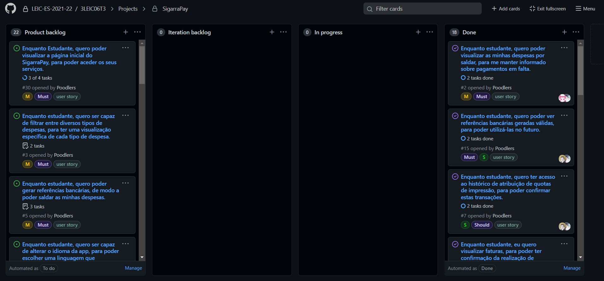

# Iteration retrospective meeting
#2 - Enquanto estudante, quero poder visualizar as minhas despesas por saldar, para me manter informado sobre pagamentos em falta.  
#15 - Enquanto estudante, quero poder ver referências bancárias geradas válidas, para poder utilizá-las no futuro.  
#7 - Enquanto estudante, quero ter acesso ao histórico de atribuição de quotas de impressão, para poder confirmar estas transações.  
#8 - Enquanto estudante, eu quero visualizar faturas, para poder ter confirmação da realização de pagamentos.  
#1 - Enquanto estudante, quero visualizar o histórico de despesas saldadas, para me manter a par dos movimentos efetuados.  
#13 - Enquanto estudante, quero ser capaz de visualizar detalhes sobre uma impressão, para obter informação mais específica sobre esta.

## What went well?
- Trabalho em equipa foi uma boa estratégia porque na maioria das vezes ter duas pessoas a procura da solução para um problema faz com que este seja mais simples.
- Conseguimos atingir todas as expectativas que tínhamos para esta iteração, visto que todos os issues que posicionamos no iteration backlog foram concretizados em tempo da entrega, com mínimos bugs.

## What should we do differently?
- Começar a trabalhar mais cedo
- Ter um melhor entendimento das classes e widgets built-in em Dart, evitando assim a possibilidade de falhar de maneiras previsíveis e conhecidas.

## What still puzzles me?
- Enquanto corremos a aplicação usando a apk release no emulador, descobrimos que havia vezes em que a recuperação de informação sobre o histórico de impressões e as suas cotas falhava. Entretanto, ao utilizar a aplicação em modo debug no Android Studio, tal falha não ocorria.

# Board

[Release v1.0.0](https://github.com/LEIC-ES-2021-22/3LEIC06T3/releases/tag/v1.0.0)

