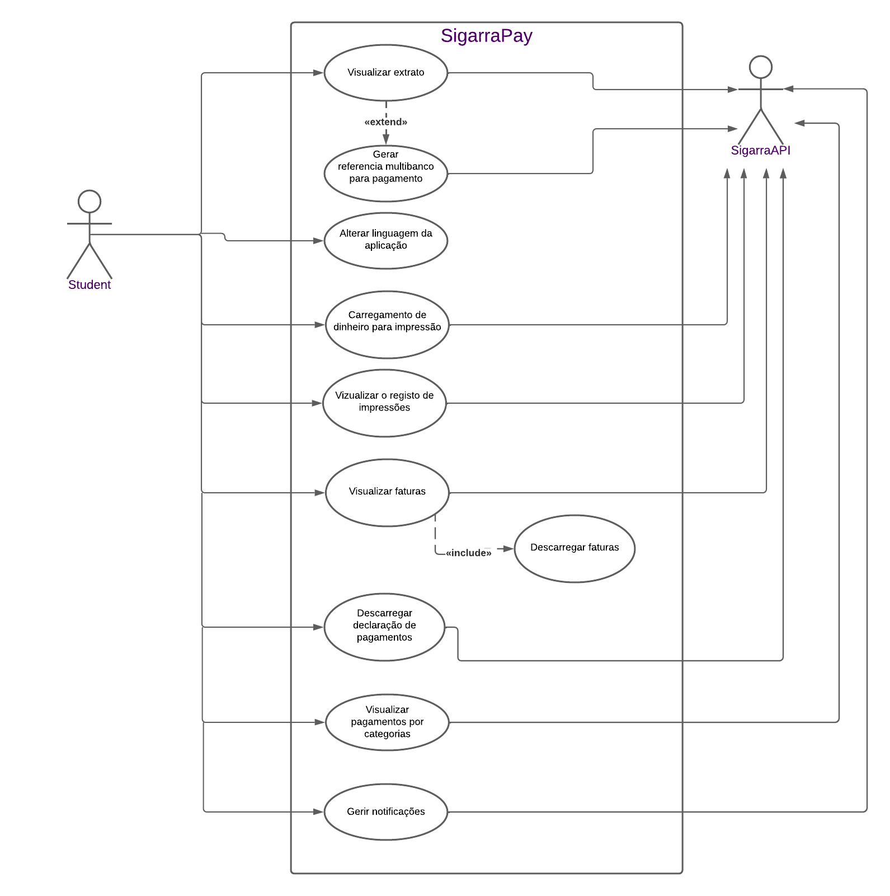
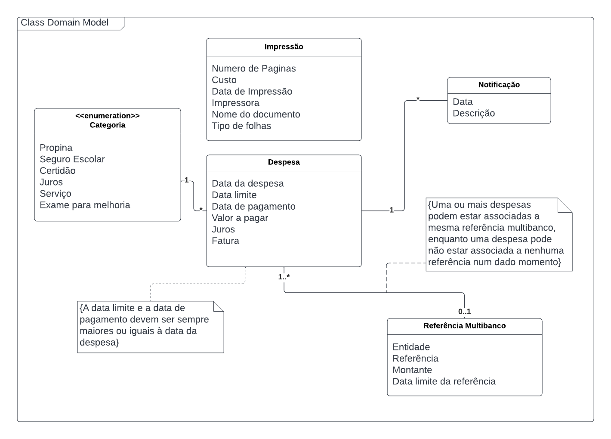

<h1>Requirements</h1>

In this section, you should describe all kinds of requirements for your module: functional and non-functional requirements.

<h2>Use case model </h2>

 

<h2>Use cases </h2>

| Nome | Visualizar extrato |
|---|---|
| Ator | Estudante |
| Descrição | Consultar o histórico de despesas, despesas por saldar entre outras. |
| Pré condições | <ul> <li>O estudante está autenticado no sistema.</li> </ul> |
| Pós condições | <ul> <li>É apresentado ao estudante o extrato currente.</li> </ul> |
| Flow normal |  <ol> <li>  O estudante acede à aplicação;</li> <li> O estudante autentica-se na app; </li> <li> O estudante seleciona SigarraPay no menu lateral;</li> <li> O estudante é encaminhado para a página inicial do SigarraPay;</li> <li> O estudante seleciona a secção de ultimos movimentos;</li> <li> O estudante é encaminhado para a página de extrato da conta corrente.</li> </ol>|
| Flows alternativos | - |

 

| Nome | Descarregar declaração de pagamentos |
|---|---|
| Ator | Estudante |
| Descrição | Descarregar a Declaração de Pagamentos da conta corrente. |
| Pré condições | <ul> <li>O estudante está autenticado no sistema.</li> </ul> |
| Pós condições | <ul> <li> O estudante recebe a Declaração de Pagamento em pdf </li> </ul>|
| Flow normal |  <ol> <li>  O estudante acede à aplicação;</li> <li> O estudante autentica-se na app; </li> <li> O estudante seleciona SigarraPay no menu lateral;</li> <li> O estudante é encaminhado para a página inicial do SigarraPay;</li> <li> O estudante seleciona a secção de ultimos movimentos;</li> <li> O estudante é encaminhado para a página de extrato da conta corrente;</li> <li>O estudante seleciona a opção de descarregar a Declaração de Pagamentos. </li></ol>|
| Flows alternativos | - |

 

| Nome | Gerar referência multibanco para pagamento |
|---|---|
| Ator | Estudante |
| Descrição | Gerar uma referência multibanco para pagamento de uma ou mais despesas. |
| Pré condições |  <ul> <li> Estudante está autenticado </li><li> Estudante tem despesas por pagar. </li></ul>|
| Pós condições | <ul> <li>O estudante é redirecionado para uma página contendo uma referência multibanco para pagamento da despesa escolhida.</li> <li>Se o estudante realizar o pagamento, a conta corrente do estudante no Sigarra é atualizada devidamente. </li> </ul>|
| Flow normal |<ol> <li>  O estudante acede à aplicação;</li> <li> O estudante autentica-se na app; </li> <li> O estudante seleciona SigarraPay no menu lateral;</li> <li> O estudante é encaminhado para a página inicial do SigarraPay;</li> <li> O estudante seleciona a secção de ultimos movimentos;</li> <li> O estudante é encaminhado para a página de extrato da conta corrente;</li>  <li>O estudante filtra as despesas por "despesas por saldar";</li>  <li>O estudante seleciona uma ou mais despesas;</li> <li> O estudante clicar na opção de gerar uma referência multibanco; </li> <li> O estudante confirma se deseja gerar a referência; </li> <li> Uma referência bancária é gerada para o pagamento;</li> <li> O estudante é encaminhado para uma página com os dados da referência criada.</li>  </ol>  |
| Flows alternativos | [Falha na confirmação] Se no passo 6, o estudante decidir não prosseguir com a geração da referência, ele será redirecionado para a página de escolha do montante. |

 

| Nome | Carregamento de dinheiro para impressão |
|---|---|
| Ator | Estudante |
| Descrição | Gerar uma referência multibanco num certo valor para carregamento de dinheiro para impressão na universidade. |
| Pré condições | <ul> <li>O estudante está autenticado no sistema.</li> </ul>|
| Pós condições |<ul> <li>O estudante é redirecionado para uma página contendo uma referência multibanco para pagamento da despesa escolhida.</li> <li>Se o estudante realizar o pagamento, a conta corrente do estudante no Sigarra é atualizada devidamente. </li> </ul> |
| Flow normal | <ol> <li>  O estudante acede à aplicação;</li> <li> O estudante autentica-se na app; </li> <li> O estudante seleciona SigarraPay no menu lateral;</li> <li> O estudante é encaminhado para a página inicial do SigarraPay;</li> <li> O estudante seleciona a secção de registos de impressões;</li> <li>O estudante seleciona o botão do multibanco;</li> <li>O estudante seleciona o montante a carregar; </li> <li>Uma referência bancária é gerada para o carregamento;</li>  <li> O estudante é encaminhado para uma página com os dados da referência criada.</li>  </ol>  |
| Flows alternativos | [Falha na confirmação] Se no passo 6, o estudante decidir não prosseguir com o carregamento, ele será redirecionado para a página de escolha do montante. |

 

| Nome | Visualizar o registo de impressões |
|---|---|
| Ator | Estudante |
| Descrição | Consultar o histórico de Atribuição de Quotas de Impressão. |
| Pré condições | <ul>  <li>O estudante está autenticado no sistema.</li> </ul> |
| Pós condições | - |
| Flow normal |  <ol> <li>  O estudante acede à aplicação;</li> <li> O estudante autentica-se na app; </li> <li> O estudante seleciona SigarraPay no menu lateral;</li> <li> O estudante é encaminhado para a página inicial do SigarraPay;</li> <li> O estudante seleciona a secção de registos de impressões.</li> </ol> |
| Flows alternativos | - |

 

| Nome | Visualizar faturas |
|---|---|
| Ator | Estudante |
| Descrição | Consulta do documento de fatura referente a um dado pagamento. |
| Pré condições | <ul>  <li>O estudante está autenticado no sistema.</li> </ul> |
| Pós condições | <ul>  <li>O estudante tem a possivbilidade de descarregar as faturas.</li> </ul> |
| Flow normal | <ol> <li>  O estudante acede à aplicação;</li> <li> O estudante autentica-se na app; </li> <li> O estudante seleciona SigarraPay no menu lateral;</li> <li> O estudante é encaminhado para a página inicial do SigarraPay;</li><li> O estudante seleciona a secção de ultimos movimentos;</li> <li> O estudante é encaminhado para a página de extrato da conta corrente;</li> <li> O estudante clica no botão de fatura de uma despesa saldada;</li> <li> O estudante encaminhado para uma página com a fatura escolhida.</li></ol> |
| Flows alternativos | - |

 

| Nome | Descarregar faturas |
|---|---|
| Ator | Estudante |
| Descrição | Consultar o histórico de despesas, despesas por saldar entre outras. |
| Pré condições | <ul>  <li>O estudante está autenticado no sistema.</li> </ul> |
| Pós condições | <ul> <li>  O estudante recebe a fatura em pdf.</li> </ul> |
| Flow normal | <ol><li>  O estudante acede à aplicação;</li> <li> O estudante autentica-se na app; </li> <li> O estudante seleciona SigarraPay no menu lateral;</li> <li> O estudante é encaminhado para a página inicial do SigarraPay;</li><li> O estudante seleciona a secção de ultimos movimentos;</li> <li> O estudante é encaminhado para a página de extrato da conta corrente;</li> <li> O estudante clica no botão de fatura de uma despesa saldada;</li> <li> O estudante encaminhado para uma página com a fatura escolhida;</li> <li> O estudante pressiona o botão de transferir faturas.</li> </ol>  |
| Flows alternativos | - |

 

| Nome | Gerir notificações |
|---|---|
| Ator | SigarraPay |
| Descrição | Gerir quando e se a app envia notificações relativas a prestações em falta cuja data limite de pagamento se aproxima ou já foi ultrapassada. |
| Pré condições |<ul> <li>O estudante está autenticado no sistema.</li> </ul> |
| Pós condições | <ul> <li> A frequência de notificações recebidas pelo estudanteé alterada. </li> </ul> |
| Flow normal | <ol> <li>  O estudante acede à aplicação; </li> <li> O estudante autentica-se na app; </li> <li> O estudante seleciona SigarraPay no menu lateral;</li> <li> O estudante é encaminhado para a página inicial do SigarraPay;</li> <li> O estudante seleciona o simbolo de notificações no canto superior esquerdo;</li><li> O estudante seleciona a opção de configuração de notificações;</li><li> O estudante altera as definições das notificações;</li> </ol>| 
| Flows alternativos | - |

 

| Nome | Visualizar pagamentos por categorias |
|---|---|
| Ator | Estudante |
| Descrição | Consultar um certo tipo de despesas. |
| Pré condições |  <ul> <li>O estudante está autenticado no sistema.</li> </ul> |
| Pós condições |  <ul> <li>Só são apresentadas ao estudante despesas da categoria escolhida.</li> </ul>  |
| Flow normal |  <ol> <li>  O estudante acede à aplicação;</li> <li> O estudante autentica-se na app; </li> <li> O estudante seleciona SigarraPay no menu lateral;</li> <li> O estudante é encaminhado para a página inicial do SigarraPay;</li><li> O estudante seleciona a secção de últimos movimentos;</li> <li> O estudante é encaminhado para a página de extrato da conta corrente;</li> <li> O estudante a roda dentada para ver as opções de filtro; </li> <li> O estudante seleciona a categoria pela qual pretende filtrar as despesas. </li> </ol>  |
| Flows alternativos | - |

 

| Nome | Alterar a linguagem da aplicação |
|---|---|
| Ator | Estudante |
| Descrição | Alterar a linguagem da aplicação de português para inglês ou de inglês para português. |
| Pré condições | - |
| Pós condições | <ul> <li>O texto em display na aplicação é alterado para a inglês ou português dependendo da linguagem de visualização anterior à mudança. </ul> |
| Flow normal |  <ol> <li>  O estudante acede à aplicação;</li> <li> O estudante autentica-se na app; </li> <li> O estudante seleciona SigarraPay no menu lateral;</li>  <li> O estudante seleciona a opção de alterar a linguagem da aplicação de português para inglês ou vice versa. </li></ol>  |
| Flows alternativos | - |

 

| Nome | Visualizar referências bancárias válidas |
|---|---|
| Ator | Estudante |
| Descrição | Visualizações de referências bancárias criadas previamente cuja validade ainda não expirou e que ainda não foram saldadas.  |
| Pré condições | <ol> <li> Estar autenticado </li> <li> Ter criado referências bancárias previamente. </li></ol>|
| Pós condições | - |
| Flow normal |  <ol> <li> O estudante acede à aplicação;</li> <li> O estudante seleciona SigarraPay no menu lateral;</li> <li> O estudante é encaminhado para a página inicial do SigarraPay;</li><li> O estudante seleciona a secção de referências bancárias;</li>  <li> O estudante é encaminhado para a página de referências bancárias geradas. </li></ol>  |
| Flows alternativos | - |

<h2> Domain model </h2>

### Depesa
Uma despesa contêm uma data na qual foi criada, uma data limite de pagamento, o valor a pagar, juros de atraso se existirem e se já tiver sido saldada a data em que foi paga e a sua fatura.
Todas as despesas têm ainda uma categoria podendo ser uma propina, um seguro escolar, uma certidão, juros, um serviço, um exame de melhoria ou uma impressão.
As despesas podem estar associadas a no máximo uma referência multibanco válida.

A data de pagamento e a data limite devem ser sempre maiores ou iguais à data da despesa.

### Referência Multibanco
Uma referência Multibanco está associada a uma ou mais despesas que o usuário pretende saldar. Esta contêm informação sobre a Entidade, a referência, o montante total e a data limite em que a referência é válida.

### Impressão
Uma impressão feita pelo utilizador contém o número de páginas imprimidas, o custo, a data de impressão, a impressora utilizada, o nome do documento e o tipo de folhas utilizadas.

### Notificação
Notificações são emitidas conforme as preferências do utilizador e tem informação sobre a sua data. Têm dois tipos distintos: quando a data limite de uma despesa que se aproxima e quando um pagamento foi concluído. 

