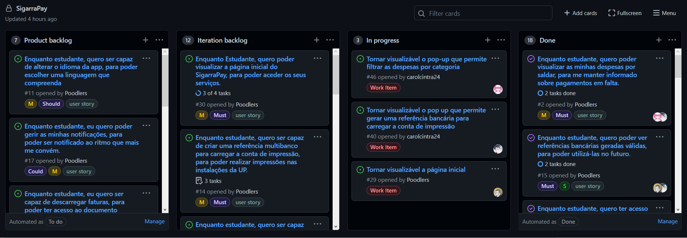
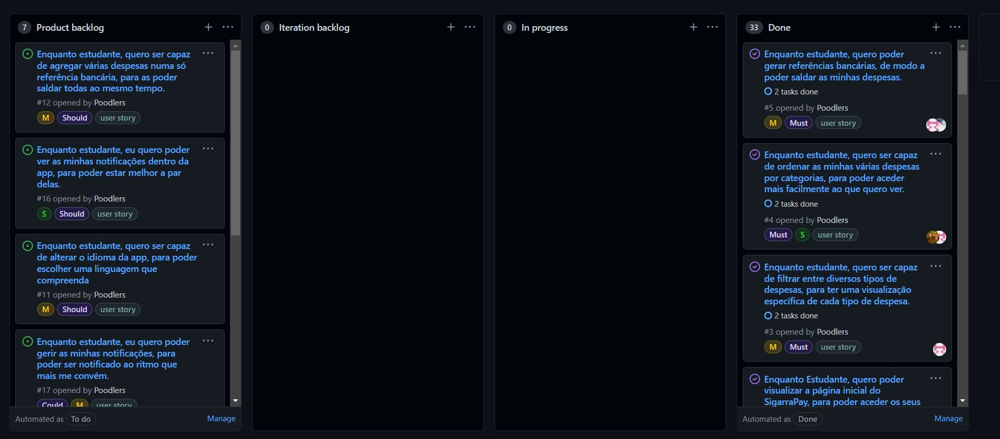

# Iteration retrospective meeting
#5 - Enquanto estudante, quero poder gerar referências bancárias, de modo a poder saldar as minhas despesas.  
#4 - Enquanto estudante, quero ser capaz de ordenar as minhas várias despesas por categorias, para poder aceder mais facilmente ao que quero ver.  
#3 - Enquanto estudante, quero ser capaz de filtrar entre diversos tipos de despesas, para ter uma visualização específica de cada tipo de despesa.  
#30 - Enquanto Estudante, quero poder visualizar a página inicial do SigarraPay, para poder aceder os seus serviços.  
#43 - Tornar visualizável detalhes de uma referência bancária.  
#14 - Enquanto estudante, quero ser capaz de criar uma referência multibanco para carregar a conta de impressão, para poder realizar impressões nas instalações da UP.

## What went well?
- Trabalho em equipa foi uma boa estratégia porque na maioria das vezes ter duas pessoas a procura da solução para um problema faz com que este seja mais simples.
- Conseguimos atingir todas as expectativas que tínhamos para esta iteração, visto que todos os issues que posicionamos no iteration backlog foram concretizados em tempo da entrega, sem bugs.

## What should we do differently?
- Fazer os acceptance tests mais cedo.

## What still puzzles me?
- A maneira que o Sigarra está formatado faz com que a recuperação de informação seja inconsistente em alguns casos - há conteúdo com diferentes nomes, dificultando assim a interligação de informação pertinente na aplicação.

# Board

[Release v2.0.0](https://github.com/LEIC-ES-2021-22/3LEIC06T3/releases/tag/v2.0.0)

